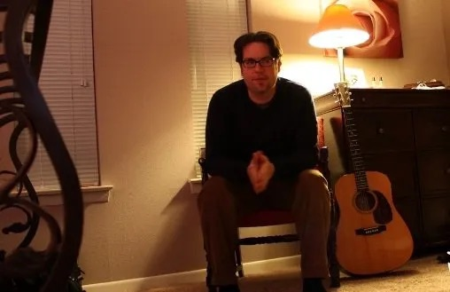

+++
date = '2024-11-25T14:57:32-06:00'
draft = false
title = 'About'
type = 'post'
+++

### _Julian West is a North Texas network engineer, musician, and writer._

#### _Trivial stuff_

I am a working-glass geek into technology, art, and good design.   
I was raised in rural Texas by parents who were both born before 1931 (I am late for everything).    
I am a self-made man with all the past mistakes to prove it. I keep growing and learning every day.    
I endured a term of poverty growing up, including a very brief period of homelessness. It was an education I wouldn’t trade for anything.      
Writing code changed my life along with curiosity, Macs, and PCs.    
Myers-Briggs says I am INTP, but I like people. At least the cool ones.    
My close friends call me “Jules”, maybe seven people. The cool ones.    
For a living I’m an ops nerd and I manage IT network projects & deployments.    
I am, despite the Cisco/Microsoft/Linux IT gig, a huge Apple geek. This is not an uncommon thing nowadays.    
I drive an electric car built in California which unfortunately transformed an autistic immigant billionaire into a problematic Oligarch. Still pondering that one.    
For hobbies I write and strum a guitar and develop messy PowerShell and Python code.