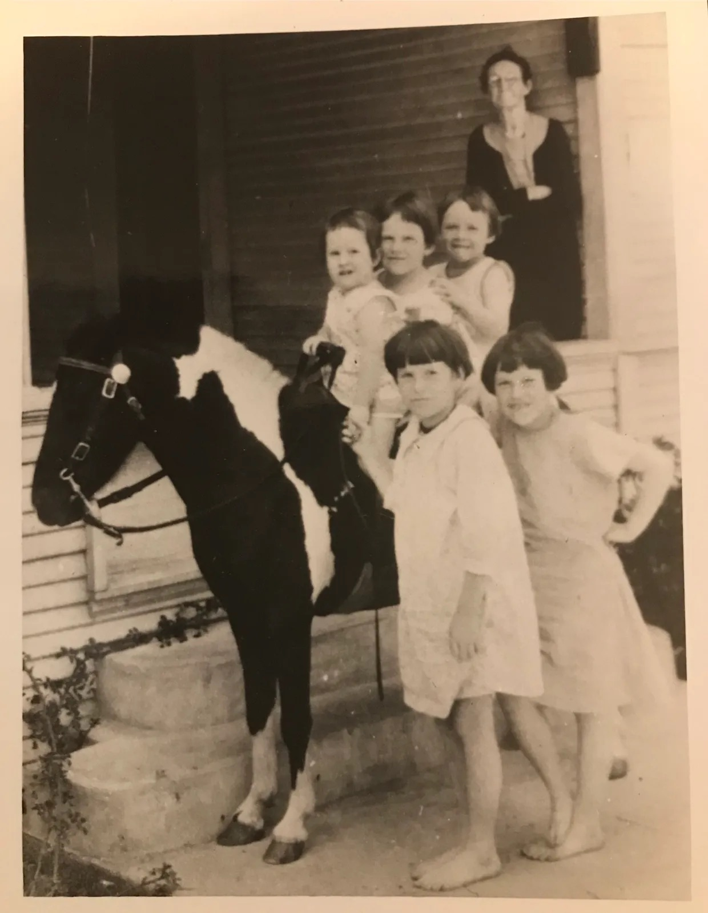

+++
date = '2019-04-28T23:04:22-06:00'
draft = false
title = 'We Are Not Orphans'
+++

In February 2019, I took a DNA test. I took the DNA test for my mother. And as it turned out, I would unexpectedly unlock a family connection that I wondered about for over 35 years. 
And together my wife and newfound cousins would help me answer my mother’s 89 year-old adoption mystery, along with another separate adoption, in our family. That DNA test changed my life, and several other lives, forever. 
My mother was adopted in 1930 while an infant, during the Great Depression. She grew up in Dallas knowing nothing about her birth family. Mom loved her adopted family and she adored her father, the late George Pennybacker. But her adopted father never really supported the idea of Mom finding her birth parents. It just wasn’t their way back in the 1930s, to adopt knowing one day you might have tell the child of their birth-parents. Many adoptive families were counseled to keep such things secret back then.
Later in life Mom would launch multiple searches. Sometimes she would find nothing, sometimes she would uncover small clues. She and my father even hired a Private Investigator to help at one point. The details he would confirm were the family name “Robertson”, “Missouri and Oklahoma roots”, and that she had siblings. 
After my father died and when I was older, I joined the search. I remember being a young man sitting in libraries hunting through vital statistics and years of records buried in microfiche. I even spoke with a Texas congressman about the futility of Texas’ sealed adoption system at the time. Dallas’ Hope Cottage was part of the brick wall, operating in a system of secrets and closed-records. As my mother aged and reached her late 60s, we stopped looking. She gave up on her dream of knowing, of finding these simple truths many adoptees search for. We gave up, but life had other plans. 
In January this year my mother, by now nearly 89, had a close-call with a stroke. She would recover, but the health scare re-stoked the fires of my search. My wife had an idea to take a DNA test from Ancestry.com, and so we ordered the test. I spit in a cup, signed a form, and my wife mailed it off. 
As it turns out, two other people also spit in their own cups. Relatives! Almost 89 years of mystery would soon unfold in a fast avalanche of information and emotion. It all happened in April. 
A few weeks after the test, I got an email from Ancestry.com saying my DNA results are in, and that I had multiple DNA cousin connections, including two First Cousins! I scratched my head and just stared at the cousin matches, I didn’t recognize the names. At first I wondered out loud which people from the West clan they could be.
My wife Kimberly is a Genealogy Master. She stopped me right there, and explained that First Cousin DNA matches aren’t super common, and it means they share the same grand parents with me. And I had TWO matches?! Kimberly then verified the DNA matches were not from my dad’s side of the family. Not Wests? This was the first confirmation, for me and my mom, that we finally had a new lead on her biological family…all these years later. 
I wrote these relatives who took the same DNA test: two other people who might help me know about my mother’s original family. As we would find out, one cousin knew almost everything…and the other cousin knew only about as much as I did. 
While we waited to hear back from the DNA matches, Kimberly got to work on the tree. What followed was most amazing Genealogical expedition I have ever witnessed. Using 2nd and 3rd cousin DNA match tree info — Kimberly dived far back into the Robertson lines from Missouri and Oklahoma. It was breathtaking watching my wife work. She strictly required a “two data points, or it doesn’t go on the tree” rule in those early days. Then she turned southward to follow each and every bloodline, down through the tree, through 150 years of history. She drew on her days of being a researcher in her graduate program years earlier, and she would put in over 40 hours of work to make that tree.
The search led her to Dallas, Texas in the early 1920s through 1930. On a Sunday night March 17th, Saint Patrick’s Day, Kimberly woke me up with a gasp:
“Pansy Burk Robertson. Julian! Julian, that is your biological-grandmother. She is your mom’s birth-mother!” 
I sat up like a bolt of lightning had hit me. It was like something my uncle Claude West once said to me, like “God’s knuckle tapping on your head” — I immediately knew this name was my mother’s long sought-after truth. Hearing the name hit me so hard, harder than I ever thought it would. In that moment I felt the weight every adoptee must feel when they first hear the name of a birth-relative. I never realized how much I had taken on my mother's desire for answers, until I heard that name. And when the name was spoken, and I looked at the name and tree on Ancestry.com, I’m not too ashamed to admit some tears welled-up in my eyes. 
Soon my cousins and I connected, and they sent me photos of my biological grandparents. And on my mother’s 89th birthday, Joy Pennybacker West first heard the names of her birth-mother and father, and gazed upon their pictures. Harry Wilbur Robertson and Pansy Robertson came alive again for her. Mother relished hearing where they were from, how they struggled in the Great Depression, and how it ultimately led to the decision to place her at Hope Cottage for adoption. Not one sad moment here: mother was fascinated, enthralled, and relieved to finally know. 
It turns out Mom had 7 other siblings, from a family wracked by the Great Depression and numerous challenges of the era. Those siblings would be surrendered by my birth grandparents to the Waco State School, where they could be fed, clothed, and educated. Many children in central, north, and south Texas would experience such a fate between 1929 and 1939. It was harsh times. For my mother, not yet born, her parents felt adoption was the only way. 

